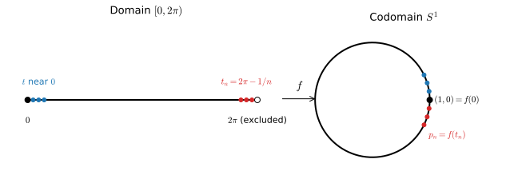

## Definitions

Let $X$ and $Y$ be topological spaces. Subsets of $\mathbb{R}^n$ carry the subspace topology induced by the Euclidean metric.

::: {#def-homeomorphism}
## Homeomorphism
A map $f : X \to Y$ is a *homeomorphism* if $f$ is bijective, $f$ is continuous, and $f^{-1} : Y \to X$ is continuous.
:::

Continuity of $f^{-1}$ is a separate requirement. It does not follow from continuity and bijectivity of $f$, as the following example shows.

## The example

::: {#exm-circle-wrap}
## Wrapping an interval onto the circle
Let $S^1 = \{ (y_1, y_2) \in \mathbb{R}^2 : y_1^2 + y_2^2 = 1 \}$ and define
$$
f : [0, 2\pi) \to S^1, \qquad f(t) = (\cos t, \sin t).
$$ {#eq-circle-wrap}
Then $f$ is a continuous bijection, but $f^{-1}$ is not continuous at $(1, 0)$. Hence $f$ is not a homeomorphism.
:::

{#fig-circle-wrap width=90%}

### $f$ is continuous

Its components $\cos$ and $\sin$ are continuous on $\mathbb{R}$, hence on $[0, 2\pi)$.

### $f$ is injective

Suppose $f(t_1) = f(t_2)$ with $t_1, t_2 \in [0, 2\pi)$. Equality of cosines and sines implies $t_1 - t_2 = 2\pi k$ for some integer $k$. Since $|t_1 - t_2| < 2\pi$, $k = 0$, so $t_1 = t_2$.

### $f$ is surjective

Every $(y_1, y_2) \in S^1$ can be written as $(\cos\theta, \sin\theta)$ for some $\theta \in \mathbb{R}$. Subtracting a suitable integer multiple of $2\pi$ gives such a $\theta$ in $[0, 2\pi)$.

### $f^{-1}$ is not continuous at $(1,0)$

Let $g = f^{-1} : S^1 \to [0, 2\pi)$ and, for $n \geq 1$,
$$
t_n = 2\pi - \frac{1}{n} \in [0, 2\pi), \qquad p_n = f(t_n) = \left( \cos\tfrac{1}{n}, \, -\sin\tfrac{1}{n} \right).
$$
Then
$$
\left| p_n - (1,0) \right| = 2 \sin\frac{1}{2n} \to 0,
$$
so $p_n \to (1,0)$ in $S^1$. However,
$$
g(p_n) = 2\pi - \frac{1}{n} \to 2\pi \neq 0 = g(1,0).
$$
Since $S^1$ and $[0, 2\pi)$ are metric spaces, sequential continuity is equivalent to continuity. Therefore $g$ is not continuous at $(1,0)$.

@fig-circle-wrap shows the mechanism: $f$ glues the two ends of the interval together, and $f^{-1}$ must tear them apart again.

### No homeomorphism exists between these spaces

The failure is not specific to $f$: no map $h : S^1 \to [0, 2\pi)$ whatsoever is a homeomorphism. Two independent arguments follow.

1. **Compactness.** $S^1$ is closed and bounded in $\mathbb{R}^2$, hence compact. $[0, 2\pi)$ is not closed in $\mathbb{R}$, hence not compact. A continuous image of a compact space is compact, so there is no continuous surjection $S^1 \to [0, 2\pi)$.
2. **Connectedness.** Removing the point $\pi$ disconnects $[0, 2\pi)$ into $[0, \pi)$ and $(\pi, 2\pi)$. Removing any point $q$ from $S^1$ leaves a connected set, namely the continuous image of an open interval of length $2\pi$. A homeomorphism $h$ would restrict to a homeomorphism between $S^1 \setminus \{h^{-1}(\pi)\}$ and $[0, 2\pi) \setminus \{\pi\}$, which is impossible.

## When a continuous bijection is automatically a homeomorphism

The example relies on the domain being non-compact and the map changing dimension. Removing either feature eliminates the pathology.

::: {#thm-compact-hausdorff}
## Compact domain, Hausdorff codomain
Let $X$ be compact, $Y$ Hausdorff, and $f : X \to Y$ a continuous bijection. Then $f$ is a homeomorphism.
:::

::: {.proof}
It suffices to show that $f$ maps closed sets to closed sets, because then $(f^{-1})^{-1}(C) = f(C)$ is closed for every closed $C \subseteq X$.
A closed subset $C$ of the compact space $X$ is compact. Its image $f(C)$ is compact because $f$ is continuous. A compact subset of a Hausdorff space is closed. Hence $f(C)$ is closed.
:::

In @exm-circle-wrap, $Y = S^1$ is Hausdorff but $X = [0, 2\pi)$ is not compact, so @thm-compact-hausdorff does not apply.

::: {#thm-invariance-domain}
## Invariance of domain (Brouwer)
Let $U \subseteq \mathbb{R}^n$ be open and $f : U \to \mathbb{R}^n$ continuous and injective. Then $f(U)$ is open and $f : U \to f(U)$ is a homeomorphism.
:::

The proof requires algebraic topology and is omitted. In @exm-circle-wrap, the domain is one-dimensional while the codomain lies in $\mathbb{R}^2$, so @thm-invariance-domain does not apply.

## Relevance to continuum mechanics

A deformation $\boldsymbol{\chi} : \mathcal{B}_0 \to \mathbb{R}^3$ is assumed continuous and injective. It is a bijection onto its image $\mathcal{B} = \boldsymbol{\chi}(\mathcal{B}_0)$. Whether $\boldsymbol{\chi}^{-1} : \mathcal{B} \to \mathcal{B}_0$ is also continuous is settled by the two theorems above.

- If $\mathcal{B}_0$ is an open subset of $\mathbb{R}^3$, @thm-invariance-domain applies with $n = 3$.
- If $\mathcal{B}_0$ is the closure of a bounded open set, it is compact. Since $\mathbb{R}^3$ is Hausdorff, @thm-compact-hausdorff applies.

In either case, $\boldsymbol{\chi}$ is a homeomorphism onto $\mathcal{B}$. Material points that are close in the current configuration were close in the reference configuration, and the inverse motion $\mathbf{X} = \boldsymbol{\chi}^{-1}(\mathbf{x})$ is continuous. @exm-circle-wrap shows that this conclusion is a genuine consequence of the setting, not a property of every continuous bijection.
